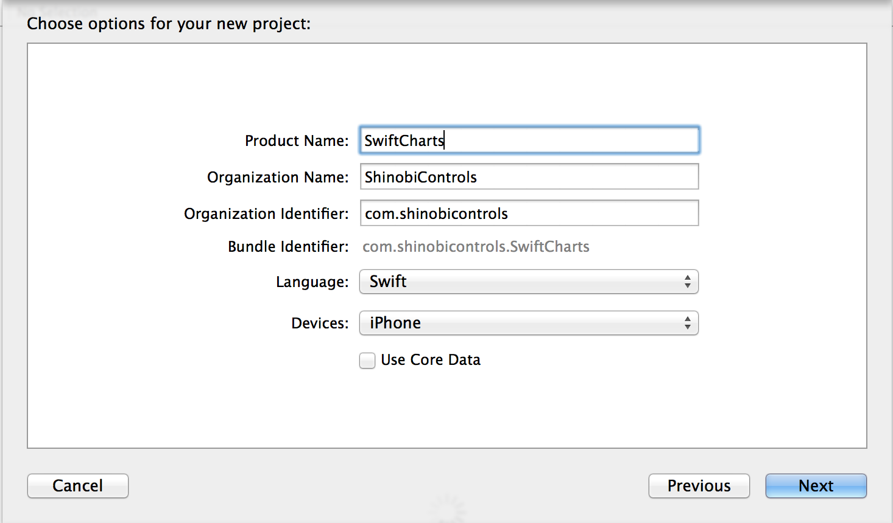
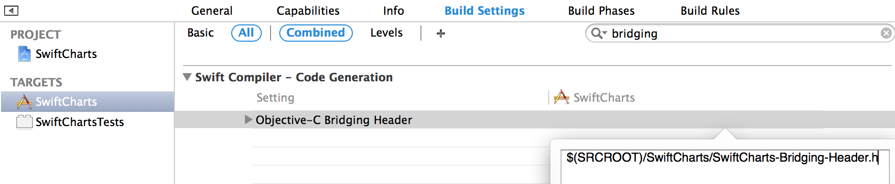
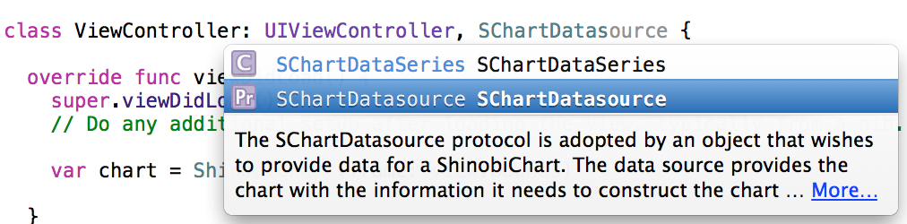
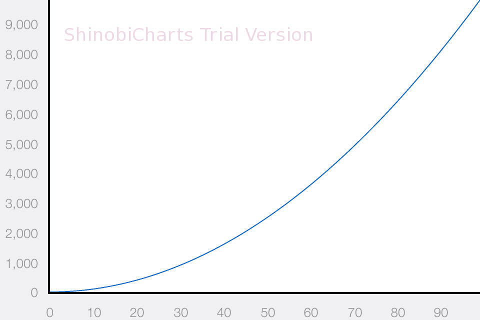

# Using ShinobiCharts with Swift on iOS8

### Introduction

Probably the most unexpected announcement from a WWDC of recent years was the
introduction of a new programming language on Monday at WWDC2014. At first
glance Swift appears to be a well-thought-out, modern language, and I think that
as developers we're going to have a lot of fun getting to know Swift and using
it over the coming years.

Obviously my first question was "how can I use ShinobiControls from Swift?", and
I'm sure it was yours too. We'll be reviewing how we adopt the new features made
available to us in Xcode 6 over the coming weeks and months, but I want to know
how to make it work now.

In this post I'll review the steps you need to go through to integrate an 
old-style framework on iOS with Swift (not to be confused by the new dynamic
frameworks introduced in iOS8). This is how all the different ShinobiControls
products are distributed, and so this represents the approach to getting them
to work in Xcode 6 beta.

It's worth noting that this process is not necessarily going to be considered
best practice in future. As I mentioned, we're reviewing the new features made
available in Xcode 6, and this includes the dynamic frameworks.

The code for this project is available on Github at ..., but it's pretty simple -
it's probably just as simple to follow along.

### Bridging ShinobiControls into Swift

There is a lot of information in the excellent documentation for Swift about
the interoperability between swift and objective-C - so I won't go into too much
detail here. We're going to use ShinobiCharts as as sample for this post - which
is distributed as a pseudo-framework for iOS. This represents objective-C code,
and therefore we need to bridge it into Swift.

Create a new single-view project, selecting Swift as the language of choice. To
import the framework, you'll have to drag it in. For some reason, the project
template created by this Xcode 6 beta doesn't have a "Frameworks" group, so create
one of those and drag __ShinobiCharts.framework__ from the finder into this group,
selecting that it should copy it into place. This will make sure that the project
links against the framework, and is the same approach you could have used in the
past.

In order for swift to be aware of the classes and methods available in any
objective-C, you have to provide a so-called bridging header. This is a simple
header file which contains all the relevant headers for the objective-C classes
you wish to be able to reference. Now, if you create an objective-C class in a
swift project, or vice-versa, then Xcode will create a bridging header for you.
However, this isn't the case for frameworks, therefore we will create one
ourselves.

Create a new header file as part of the project and call it 
__SwiftCharts-Bridging-Header.h__ - the conventional name for bridging headers.
Add the following line to the newly created file:

  #import <ShinobiCharts/ShinobiChart.h>

Here we're just importing the standard header used for ShinobiCharts - you can
add any other objective-C headers that you wish to call from swift.

The other thing we need to do is to make sure that Xcode knows that it should
treat this file as a bridging header. Again, this would have been set up for you
had you created an objective-C file in the swift project, but since we're importing
a framework, we have to do it ourselves.

Open the build settings for the __SwiftCharts__ target and search for the 
__Objective-C Bridging Header__ setting - set it to the following string:

  $(SRCROOT)/SwiftCharts/SwiftCharts-Bridging-Header.h

This tells the compiler which file it should be using to bridge between swift
and objective-C.

### Creating your first Swift chart

In the same way that you do with objective-C projects, you need to add some
additional frameworks to your project in order that it will build. Add the
following on the __General__ project settings page:

- CoreText.framework
- libc++.dylib
- OpenGLES.framework
- Security.framework

Now you're ready to go! Open up __ViewController.swift__ and update the 
`viewDidLoad` function to match the following:

    override func viewDidLoad() {
      super.viewDidLoad()
      // Do any additional setup after loading the view, typically from a nib.
      
      let chart = ShinobiChart(frame: view.bounds)
      chart.licenseKey = "<YOUR LICENSE KEY HERE>"
      chart.datasource = self
      chart.autoresizingMask = .FlexibleHeight | .FlexibleWidth
      view.addSubview(chart)
    }

This is just the literal swift translation of the objective-C equivalent:

- `let` is used since we know we don't want to change the chart object once it
has been created.
- `ShinobiChart(frame: ...)` is the swift translation of the objective-C method
`- initWithFrame:`
- We set the `datasource` property to the current object - which means we need
to adopt the `SChartDatasource` protocol and implement the required functions.

To adopt a protocol, add it at the end of the comma-separated list after the
superclass in the class definition:

    class ViewController: UIViewController, SChartDatasource {

And then implement the 4 required methods as you would in objective-C. Notice that
code completion has automatically created the swift function signatures from the
objective-C methods:

  /* SChartDatasource methods */
  func numberOfSeriesInSChart(chart: ShinobiChart!) -> Int {
    return 1
  }
    
  func sChart(chart: ShinobiChart!, seriesAtIndex index: Int) -> SChartSeries! {
    return SChartLineSeries()
  }
    
  func sChart(chart: ShinobiChart!, numberOfDataPointsForSeriesAtIndex seriesIndex: Int) -> Int {
    return 100
  }
    
  func sChart(chart: ShinobiChart!, dataPointAtIndex dataIndex: Int, forSeriesAtIndex seriesIndex: Int) -> SChartData! {
    let dp = SChartDataPoint()
    dp.xValue = dataIndex
    dp.yValue = dataIndex * dataIndex
    return dp
  }

Most of this is fairly self-explanatory, and follows the same pattern as in objective-C,
but there are a few things that are worth mentioning:

- The return-type in the method signature now appears at the end, after the `->`
symbol. Functions are just named closures in swift, so this follows the closure
syntax.
- All the `NSObject` subclass parameters have exclamation marks at the end of their
types (e.g. `chart: ShinobiChart!`). This is because of the type system in swift
doesn't allow nil-values for variables, unless they are made optional. This is
in direct contradiction to objective-C, where any object reference can be nil.
Therefore, the objective-C objects in the delegate signatures are optionals. The
exclamation mark unwraps the optional value - which means that the value will be
set to the parameter, and a run-time error will occur if nil is passed in.

If you run the app up now, then you'll have created your first ShinobiCharts app
using swift!

### Conclusion

